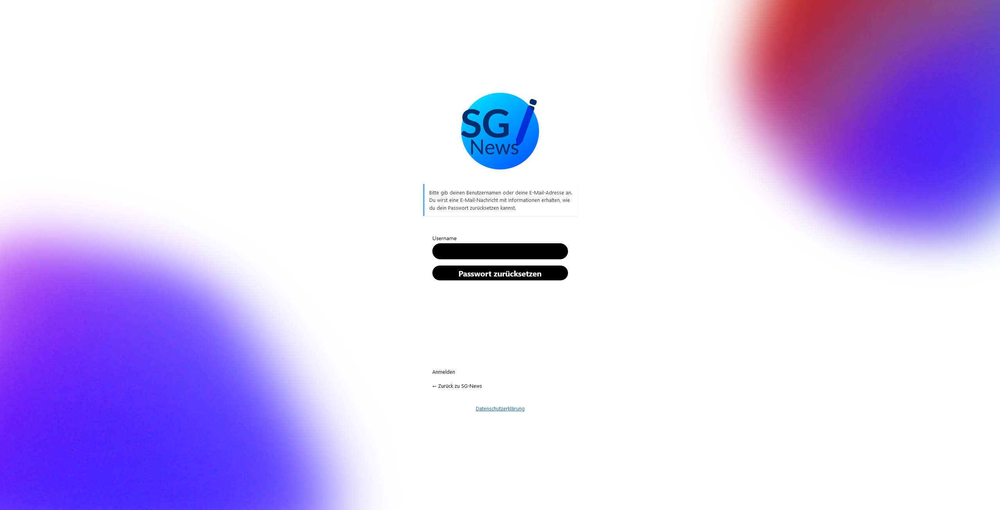
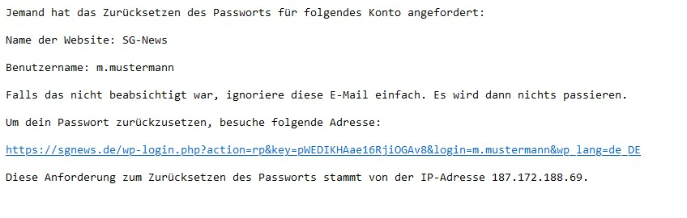

## Zurücksetzen
Um dein Passwort zurückzusetzen, gebe unter https://sgnews.de/wp-login.php?action=lostpassword deinen Nutzernamen an.

Daraufhin erhälst du in deinem mit der @sgnews.de Adresse verknüpftem Postfach eine E-Mail, um dein Passwort zu ändern.

Gehe dafür auf den Link und gebe wie bei der Erstellung deines Accounts ein Passwort an. Dieses darf nicht das gerade verwendete sein.