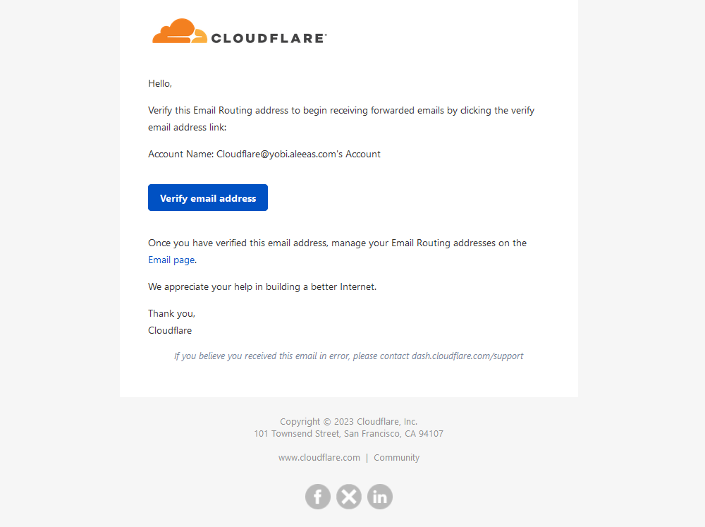
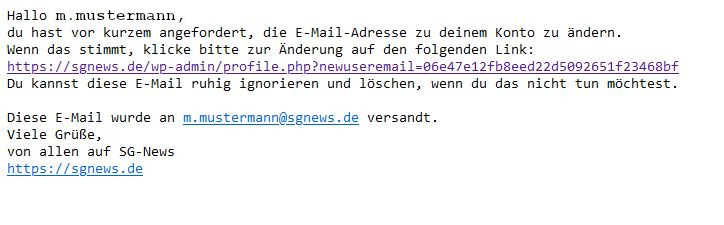

import { Aside } from '@astrojs/starlight/components';

## Zugang beantragen
Um einen Zugang zu beantragen, kontaktiere bitte einen Admin per E-Mail: dev@sgnews.de. In dieser gibst folgende Daten an:
- eine E-Mail-Adresse (falls keine angegeben wird die Senderadresse benutzt)
- deinen Vor- und Nachnamen
- gegebenenfalls Sonderberechtigungen

## E-Mail
Nachdem dein Account beantragt ist, bekommst du eine Bestätigungabfrage von Cloudflare an deine angegebene E-Mail-Adresse gesendet.

Klicke bei dieser auf den blauen Button mit der Beschriftung "Verify email adress", um deine SG-News Adresse zu aktivieren. Du wirst daraufhin zu einem Login weitergeleitet. Diesen kannst du aber ohne Bedenken schließen. Du brauchst dich dort nicht einloggen.

## Account
<Aside type="caution" title="Achtung">
  Bevor dein Account unter sgnews.de erstellt werden kann musst du die Cloudflare E-Mail bestätigen. [mehr](#e-mail)
</Aside>
Nach der Registrierung deiner Mailadresse erhälst du eine weitere E-Mail bezüglich der Einrichtung deines sgnews.de Accounts.

In dieser steht zwar, dass angefordert wurde, die E-Mail des Kontos zu ändern, jedoch erhälst du diese Nachricht auch, wenn der Account neu erstellt wurde. mit dem ersten Link gelangst du zu einer Seite, auf der du dein Passwort festlegen musst. Herzlichen Glückwunsch! Du kannst nun Artikel auf der Website verfassen und veröffentlichen.